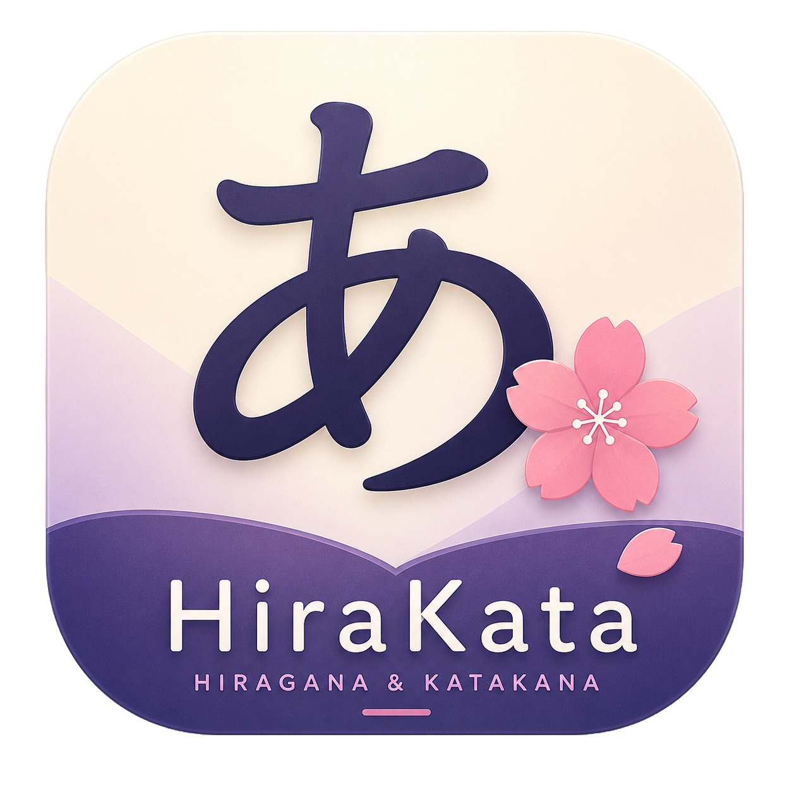

  

  # HiraKata

  **The simplest, smoothest, and most beginner-friendly Japanese Hiragana & Katakana learning app.**

  
  
  
  

   

  

    

  [Latest Release Notes](https://github.com/IshtiAK47/HiraKata/releases/tag/1.0.0) • [Report Issue](https://github.com/IshtiAK47/HiraKata/issues) • [Developer Profile](https://www.ishtiak47.me)

---

## 🌟 Overview

**HiraKata** is built with a single clear goal: to guide complete beginners in recognizing, understanding, and memorizing every Japanese **Hiragana** and **Katakana** character effortlessly.

Rather than overwhelming learners with complex grammar lessons, HiraKata focuses strictly on **visual memorization, authentic pronunciation, and interactive practice**.

---

## ✨ Key Features

- **📖 Complete 208 Character Library**:
  - Covers all 104 Hiragana + 104 Katakana characters.
  - Divided into 4 structured tracks: **Basic**, **Dakuten**, **Handakuten**, and **Yōon**.
  - Includes easy mnemonic hints, stroke order visualizer, and practical example words for every character.

- **🔊 Authentic Japanese TTS Voice Audio**:
  - Instant voice pronunciation (`ja-JP`) for all characters and example words.
  - Custom speech rate tailored for clear beginner listening.

- **🎴 4 Interactive Practice Modes**:
  - **Flashcards**: Smooth 3D card flip gestures with interactive memory assessment (*I Know This* / *Still Learning*).
  - **Quiz Mode**: 4-choice multiple-choice quizzes with instant haptic and visual feedback.
  - **Recognition Mode**: High-speed identification training.
  - **Matching Game**: Pair Japanese characters with their Romaji equivalents.

- **📊 Reactive Progress & Streak Dashboard**:
  - Automatically tracks character mastery, accuracy rates, and daily study streaks.
  - Persistent local storage using `SharedPreferences`.

- **🎨 Modern Aesthetic & Theme Selection**:
  - Full support for **System Default**, **Light Mode**, and **Dark Mode**.
  - Crafted using Material 3 guidelines, sleek card elevation, and smooth micro-animations (`flutter_animate`).

- **⚡ Instant Clean Launch**:
  - Opens straight to your learning dashboard with zero splash screen delays.

---

## 📱 Screenshots & Demo

| Dashboard & Progress | Character Lesson View | Practice Modes | Settings & Themes |
| :---: | :---: | :---: | :---: |
| 📊 Home & Track Progress | 🎌 Stroke Order & Mnemonics | 🎴 3D Flashcards & Quizzes | ⚙️ Light / Dark Customization |

---

## 📥 Download & Installation

You can download the compiled Android APK directly onto your device:

1. Click to download: **[Download HiraKata v1.0.0 APK](https://github.com/IshtiAK47/HiraKata/releases/download/1.0.0/app-release.apk)**
2. Open the downloaded `app-release.apk` on your Android device.
3. Tap **Install**. *(If prompted, allow installation from unknown sources in Android Settings)*.

---

## 🛠️ Tech Stack & Architecture

- **Framework**: [Flutter](https://flutter.dev) (Dart SDK `^3.12.2`)
- **State Management**: [Riverpod](https://riverpod.dev) (`flutter_riverpod` 2.6.1)
- **Routing**: [GoRouter](https://pub.dev/packages/go_router) (`go_router` 14.8.1)
- **Local Persistence**: `shared_preferences` (2.3.5)
- **Voice Audio**: `flutter_tts` (4.2.5, `ja-JP`)
- **Animations**: `flutter_animate` (4.5.2)
- **Typography**: Google Fonts (`Inter` & `Noto Sans JP`)

---

## 👨‍💻 Developer & Credits

Crafted with care by **Ishtiak Mahmood**.

- **GitHub Profile**: [@ishtiak47](https://github.com/ishtiak47)
- **Portfolio Website**: [www.ishtiak47.me](https://www.ishtiak47.me)
- **App Repository**: [github.com/IshtiAK47/HiraKata](https://github.com/IshtiAK47/HiraKata)

---

## 📄 License

This project is open-source under the [MIT License](LICENSE).
